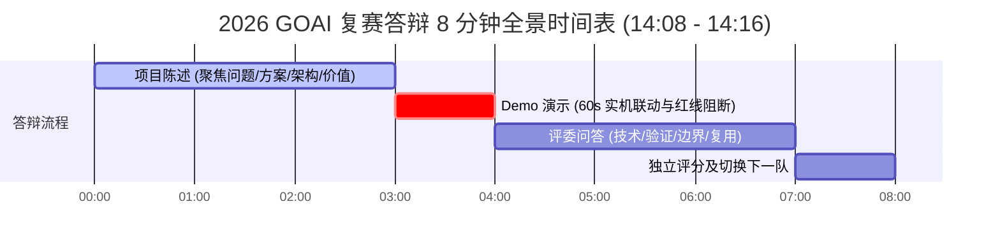
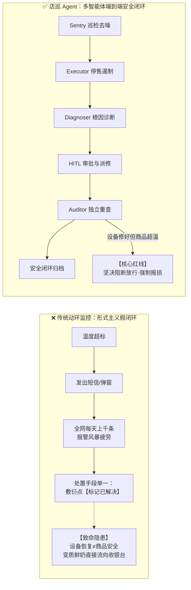
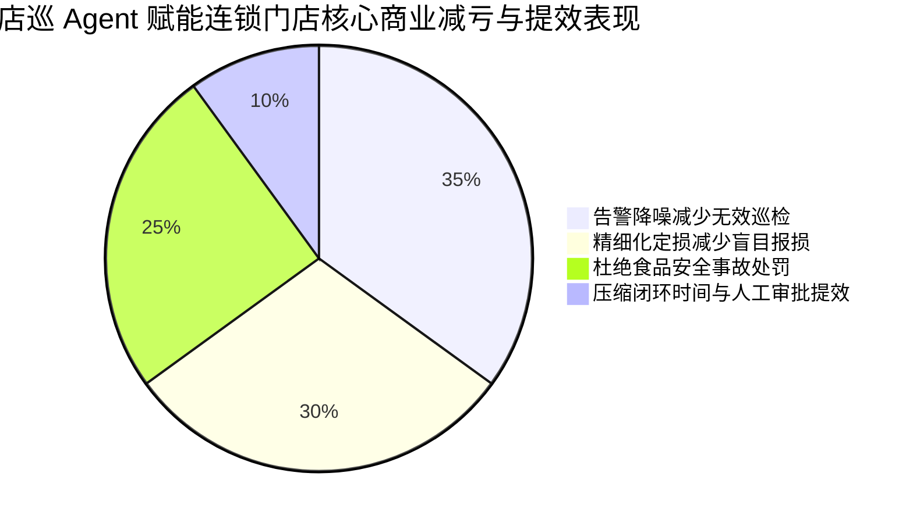
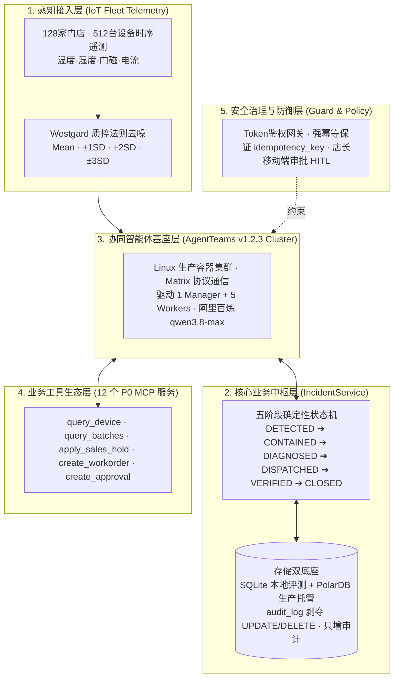
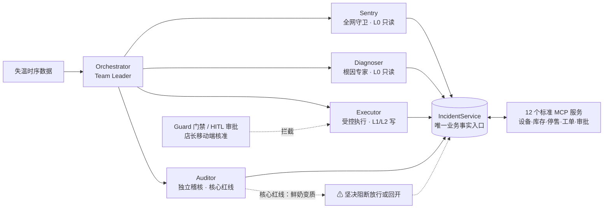
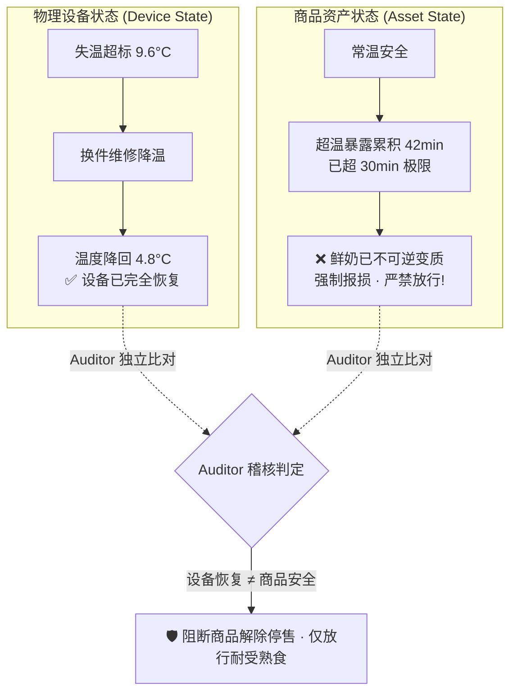

# 2026 GOAI 赛道一 (Agent Infra) 复赛答辩图文全景手册

> **队伍名称**：逐光（第 3 组｜第 13 队）  
> **作品名称**：店巡 Agent（面向连锁门店的物理异常闭环基础设施）  
> **答辩时间**：2026 年 9 月 4 日 14:08 — 14:16（**请务必于 13:58 前进入钉钉候场区**）  
> **答辩总时长**：严格控制为 **8 分钟**（项目陈述 3 分钟 + Demo 演示 1 分钟 + 评委问答 3 分钟 + 独立评分及切换 1 分钟）  
> **官方在线指挥中心**：https://mazhi.icu/zhuguang/ （备用镜像：https://mazhi.icu/dianxun/）  
> **15 页演示 PPT**：https://mazhi.icu/zhuguang/ppt/  
> **实机集群状态 API**：https://mazhi.icu/zhuguang/status.json

---

## 目录
1. [8 分钟答辩节奏与时间分配图](#一8-分钟答辩节奏与时间分配图)
2. [为什么做？痛点透视与传统方案对比](#二为什么做痛点透视与传统方案对比)
3. [项目的核心价值点与量化商业收益](#三项目的核心价值点与量化商业收益)
4. [具体技术方案：五层解耦架构全景](#四具体技术方案五层解耦架构全景)
5. [Agent 协同设计：5 大专业 Worker 职责分离](#五agent-协同设计5-大专业-worker-职责分离)
6. [核心技术亮点：双重状态解耦与 Westgard 质控](#六核心技术亮点双重状态解耦与-westgard-质控)
7. [【3 分钟项目陈述】逐字实战演练脚本](#七3-分钟项目陈述逐字实战演练脚本)
8. [【1 分钟 Demo 演示】60 秒联动操作台词表](#八1-分钟-demo-演示60-秒联动操作台词表)
9. [【3 分钟评委问答】官方 4 大维度靶向攻防库](#九3-分钟评委问答官方-4-大维度靶向攻防库)
10. [答辩应急检查清单与双屏操作方案](#十答辩应急检查清单与双屏操作方案)

---

## 一、8 分钟答辩节奏与时间分配图

组委会对答辩时间卡得非常严格（共 8 分钟）。时间节点与屏幕流转如下：



- **00:00 - 03:00（前 3 分钟）**：全屏共享播放 **[15 页 PPT](https://mazhi.icu/zhuguang/ppt/)**，按顺序陈述痛点、架构、协同与价值；
- **03:00 - 04:00（第 4 分钟）**：平滑切至 **[指挥中心](https://mazhi.icu/zhuguang/)** 第一栏，点击 **【一键演练 (60s)】**；
- **04:00 - 07:00（后 3 分钟）**：保留指挥中心页面，靶向回答评委提问，可随时调阅 6 大场景时序与实机集群拓扑。

---

## 二、为什么做？痛点透视与传统方案对比

在实体零售与连锁冷链的真实世界中，现有的传统动环系统与人工运维存在**三大致命断层**：



### 1. “告警已读，事故未消”的断层
传统监控只做单点硬阈值报警。全网每天几百上千条告警，店员产生“告警麻木”；系统提供的唯一处置手段居然是**点一下【标记已解决】**，这是极其危险的形式主义假闭环。

### 2. “设备恢复 ≠ 商品安全”的断层（行业最大盲区）
冷柜跳闸两小时后恢复制冷、温度降回 4°C，传统系统显示变绿。**但柜内的巴氏鲜奶在超温环境下暴露超过 30 分钟早已不可逆变质！** 现有系统缺乏商品暴露状态追踪，导致变质商品被直接卖给顾客。

### 3. “执行与验收一体”的自验漏洞
派工、维修、验收由同一方完成，缺乏制约，“执行者自己宣布自己修好了”，缺乏独立第三方查证事实的机制。

---

## 三、项目的核心价值点与量化商业收益



### 1. 核心价值主张
- **交付单位升维**：交付的不是一条冷冰冰的告警，而是一份**“责任清晰、证据完备、通过安全门禁的闭环事件包”**；
- **物理世界的职责分离**：建立总控、巡检、诊断、执行、独立稽核的角色隔离，消除自验自放；
- **工业级 Agent Infra 规范**：提供标准 Skill 九要素契约、12 个解耦 MCP、有状态业务中枢与 Append-only 审计流。

### 2. 量化商业回报
1. **食品安全事故“零容忍”**：20 秒内自动对失温商品下发 POS 停售锁，100% 杜绝变质品流向收银台；
2. **精细化处置减亏 60%+**：改变以往“冷柜一失温整柜全报废”的做法，结合暴露积分精细定损：变质鲜奶报损，耐受熟食调拨冷库；
3. **报警降噪 90%+**：Westgard 质控法则过滤开门补货瞬时波动，消灭告警风暴；
4. **全链路 100% 审计可穿透**：全流程留存 Evidence 哈希与 Matrix Trace，满足最严苛的食品安全合规审查。

---

## 四、具体技术方案：五层解耦架构全景



---

## 五、Agent 协同设计：5 大专业 Worker 职责分离

店巡 Agent 严格坚持**最小权限原则（PoLP）与职责硬隔离**，各 Agent 权限与职责如下：



| Agent 角色 | 权限级别 | 核心职责与边界约束 | 避免的核心风险 |
| :--- | :--- | :--- | :--- |
| **Orchestrator** | 协调调度 | 全局目标拆解、阶段推进与复盘沉淀，**无任何领域写权限** | 杜绝总控大模型因幻觉私自篡改数据 |
| **Sentry** | L0 只读 | 30s 周期巡检全网 512 台设备，Westgard 去噪，发起遏制请求 | 过滤无效报警，杜绝告警风暴 |
| **Diagnoser** | L0 只读 | 排除门磁与除霜，锁定压缩机电容；计算批次超温暴露时长 | 杜绝盲目报损，实现精细化定损 |
| **Executor** | L1/L2 受控写 | 执行 POS 停售锁、派发工单，全量写操作强制附带幂等键 | 杜绝未授权操作与重复扣费派修 |
| **Auditor** | 独立稽核 | 独立开辟干净上下文，重查设备与商品双重事实，一票否决权 | **杜绝执行者自验自放，严守变质阻断红线** |
| **Policy/Guard**| 安全拦截 | 拦截维修超额与大额报损，挂起触发店长手机审批（HITL） | 杜绝大模型在物理世界乱花钱 |

---

## 六、核心技术亮点：双重状态解耦与 Westgard 质控

### 1. 物理世界“双重状态解耦模型”（业界首创）



### 2. S03 门店实时温度走势折线图与 Westgard 质控区间

```
 温度 (°C)
  10.0 │                           ┌───────────┐ (峰值 9.6°C · 压缩机停转)
       │                           │           │
   8.5 │- - - - - - - - - - - - - -│- - - - - -│- - - - - - - - - -  Westgard +3SD (8.5°C 警戒线)
   8.0 ├───────────────────────────│───────────│───────────────────  8.0°C 告警上限红线
       │                   ▲       │ 红色超温  │       ▼
       │                   │       │ 暴露危险区│       │ (维保换件迅速降温)
   4.2 │────── 正常运行 ───┘       │ 42 分钟   │       └─── 回落至 4.8°C ──
   2.0 ├───────────────────────────┴───────────┴───────────────────  2.0°C 正常下限
       └──────────────────────────────────────────────────────────── 时间
         08:20       08:40       09:00       09:20       09:40
                                (Sentry锁定) (停售与派单)(换件恢复)
```

---

## 七、【3 分钟项目陈述】逐字实战演练脚本

> **演示载体**：投屏打开 **[PPT 在线演示](https://mazhi.icu/zhuguang/ppt/)**，按左右方向键翻页。

### 00:00 - 00:40（痛点聚焦 · 40秒）
> “各位评委老师下午好！我是逐光队，今天汇报的作品是面向连锁门店的物理异常闭环基础设施——**店巡 Agent**。  
> 
> 在便利店冷链运维中，冷柜失温看似简单，但现有方案存在三个致命缺陷：  
> 第一，**告警风暴与假闭环**：传统监控只做单点硬报警，全网每天上千条报警让店员疲劳麻木，处置手段只有一个敷衍的‘标记已解决’，这是典型的‘告警已读，事故未消’；  
> 第二，**双重状态严重脱节**：**设备恢复不等于商品安全**！冷柜修好了、温度降回去了，但超温暴露超标的鲜牛奶依然已经变质；  
> 第三，**缺乏职责制衡**：派工、维修、验收常由同一人自验自放。  
> 
> 因此，店巡 Agent 解决的不是发告警，而是**让异常从发现、遏制、诊断，真正走向独立稽核与安全闭环**。”

### 00:40 - 01:40（方案与多 Agent 协同 · 60秒）
> “在架构设计上，我们基于赛道指定的 **AgentTeams v1.2.3** 基础设施，构建了 1 个 Team Leader + 5 个业务 Worker 的拓扑体系，坚持严格的**职责分离与权限隔离**：  
> • **Orchestrator（总控编排）**：负责全局目标拆解与状态推进，只调度协调，没有任何领域写权限；  
> • **Sentry（全网守卫 · 只读）**：以 30 秒周期并行巡检全网 128 店 512 台设备，引入 Westgard 质控法则时序去噪，精准锁定异常单柜，发起紧急遏制；  
> • **Diagnoser（根因诊断 · 只读）**：排查门磁与除霜，锁定压缩机故障，同时积分计算每批次商品超温暴露时长；  
> • **Executor（受控执行 · 受控写）**：下发 POS 停售锁、派发急修工单，全量写操作强制挂载幂等键；  
> • **Auditor（独立稽核 · 核心红线守门员）**：**执行者不能自证成功！** Auditor 必须独立调用接口重查设备与商品双重事实，只要商品变质，坚决阻断放行或回开事件！”

### 01:40 - 02:20（技术亮点与安全边界 · 40秒）
> “在底层 Agent Infra 创新与安全防御上，我们重点构筑了三层防线：  
> • **有状态业务中枢（IncidentService）**：定义了严格的五阶段业务状态机，支持大模型断线重连与故障原子恢复；  
> • **高风险人机协同（HITL）**：维修预算超限或商品强制报损时，Policy 门禁自动拦截并挂起，推送店长移动端一键核准，杜绝模型越权；  
> • **金融级防篡改审计**：在数据库底层剥夺 `audit_log` 的 UPDATE 和 DELETE 权限，保证全链路操作‘只增不改’，完美契合食品安全合规溯源。”

### 02:20 - 03:00（可验证价值与规模化复制 · 40秒）
> “逐光项目拒绝空洞的概念设计，所有能力均已在生产级环境中严密验证：  
> • **真实生产集群**：部署于广州 Linux 服务器，接入阿里百炼 qwen3.8-max，通过 Matrix 协议驱动实机多 Worker；  
> • **确定性证据链**：内置 87 个自动化测试用例，覆盖 6 大正常与对抗场景，沉淀了 45 份不可篡改的 Evidence 证据包和 26 条 Trace 链路，违规放行率为 0；  
> • **广泛的复用能力**：规范治理 6 大核心 P0 Skill，不仅能管便利店冷柜，更能无缝迁移至**医药疫苗冷链、中央厨房 HACCP 品控与数据中心动环**！  
> 
> 下面进入 1 分钟实机协同 Demo 演示！”

---

## 八、【1 分钟 Demo 演示】60 秒联动操作台词表

> **演示载体**：投屏切入 **[官方指挥中心](https://mazhi.icu/zhuguang/)** 第一栏，点击 **【一键演练 (60s)】**

| 时间轴 | 顶部全网与设备矩阵表现 | 温度图表与徽章表现 | 核心解说词（配合画面动作） | 官方考核点对应 |
| :--- | :--- | :--- | :--- | :--- |
| **00-10s<br/>STEP 1** | • 顶部 128 店全网扫描：S01/S02/S04 绿灯，精准锁定 **S03 店 1 号柜（标红 9.6°C）** | 游标跳至 9.6°C，突破 Westgard +3SD 红线，红色超温暴露区开始填充 | “Sentry 巡检全网 512 台设备，自动过滤常规开门波动，精准捕捉到 S03 天河店 1 号鲜奶柜突破 8°C 告警线，排除断流，向总控发出紧急遏制请求。” | **关键链路<br/>异常发现** |
| **10-20s<br/>STEP 2** | • 1 号设备打上【已停售拦截】徽章 | 图表浮现橙色徽章：<br/>**【🔒 Executor: 停售锁已下发】** | “食品安全第一！Executor 立即下发 L1 预授权动作，通过 MCP 切断 POS 收银结算，防止潜在变质品流向顾客。” | **Agent 协作<br/>受控遏制** |
| **20-30s<br/>STEP 3** | • 1 号设备状态更新为压缩机电容故障 | 暴露时长累积至 35 分钟（突破 30m 红线） | “Diagnoser 综合排查门磁与除霜，锁定压缩机电容老化（置信度 0.94）；同时计算鲜奶已超温暴露 35 分钟，建议强制报损，熟食调拨备用冷柜。” | **多源诊断<br/>资产评估** |
| **30-40s<br/>STEP 4** | • 维保技工到店换件 | **温度折线快速俯冲降温至 7.2°C** | “维修预算触发店长手机端一键审批（HITL）。冷修技工到店换件，冷柜重新制冷，温度快速向下回落！” | **HITL 审批<br/>闭环降温** |
| **40-50s<br/>STEP 5**<br/>🔥 **高光时刻** | • 1 号冷柜温度降至 **4.8°C（设备完全恢复变绿）** | 图表上方立刻弹出一道深红阻断徽章：<br/>**【🛡️ Auditor: 鲜奶超温变质阻断放行!】** | **“请评委老师重点关注核心安全红线：冷柜虽已降回 4.8°C，但 Auditor 独立重查判定鲜奶暴露 42 分钟已不可逆变质，坚决阻断放行、强制报损！彻底终结执行者自验自放！”** | **异常处理证据<br/>核心红线阻断** |
| **50-60s<br/>STEP 6** | • 鲜奶销毁，熟食放行，设备状态安全关闭<br/>• **左上角 S03 门店瞬间由红变绿，全网 512 台设备重归全绿守护！** | 游标归档，图表归入历史基线 | “熟食转移合规放行，变质鲜奶销毁报损。Orchestrator 沉淀电容老化知识条目，事件安全关闭，全网重归全绿守护，完成高可靠闭环！” | **复盘知识沉淀<br/>安全关闭** |

---

## 九、【3 分钟评委问答】官方 4 大维度靶向攻防库

### 维度 1：技术方案（AgentTeams 架构与底层机制）
- **Q1：为什么必须采用 AgentTeams 多 Agent 架构，而不是用一个超强的大模型配一长串 Prompt？**
  - **A**：“评委老师，单个 Agent 在物理世界的高风险操作中存在天然缺陷：
    1. **无法做协议级权限硬隔离**：Prompt 无法限制模型写操作。在 AgentTeams 中，Sentry 和 Diagnoser 只有 L0 只读权限，Executor 拥有受控写权限，Auditor 拥有独立稽核权限，从 Token 层面杜绝越权；
    2. **违反职责分离原则**：‘运动员不能兼任裁判员’。如果单 Agent 执行了维修，它倾向于在同一个上下文里自证‘我修好了’，从而导致变质商品被盲目放行。多 Agent 才能支持 Auditor 独立开辟干净上下文重新核验客观事实。”
- **Q2：你们在 AgentTeams 上做了哪些底层 Infra 创新？**
  - **A**：“我们主要实现了三个 Infra 关键增强：
    1. **有状态业务中枢（IncidentService）**：弥补 LLM 无状态缺陷，维持严格的五阶段状态机，支持断点原子重入；
    2. **标准 MCP 工具生态**：封装了 12 个解耦的 MCP 服务，满足 AgentTeams 跨网络调用；
    3. **全链路 Evidence 哈希存证**：每次状态迁移均自动生成 SHA-256 哈希指纹与 Matrix Trace，实现操作不可抵赖。”

---

### 维度 2：可运行验证（防概念稿、证据链真实性）
- **Q3：怎么证明你们这套系统是真实部署可运行的，而不是本地前端写死的假动画？**
  - **A**：“我们提供了两套可随时验证的真实凭证：
    1. **线上实机集群实时接口**：各位评委访问我们主页的 `status.json`（https://mazhi.icu/zhuguang/status.json），这是部署在广州 Linux 服务器上的 AgentTeams v1.2.3 真实环境，5 个 Worker 容器、阿里百炼 `qwen3.8-max` 驱动、实时内存与端口心跳一目了然；
    2. **本地确定性评测命令**：组委会拉取仓库代码后，只需执行一行命令 `uv run dianxun evaluate`，即可在独立 SQLite/Trace 数据库中完整重放 6 个端到端场景（含超时、工具崩溃、对抗攻击），87 个测试用例全部通过，产出结构化的 Evidence 证据报告。”

---

### 维度 3：风险边界与安全机制（大模型防幻觉、HITL 审批、审计防篡改）
- **Q4：大模型经常出现‘幻觉’或‘失控调用’，你们如何确保不会乱派修、乱扣钱、乱停售？**
  - **A**：“我们设计了**四道纵深防御红线**：
    1. **Policy 门禁与 HITL 审批**：所有涉及金钱（如维修费超限）或资产处置（鲜奶报损）的高风险操作，被 Policy 门禁强制拦截并挂起，必须由店长在手机端人工核准（HITL），否则 Executor 拿不到执行 Token；
    2. **全量写操作强幂等**：所有 MCP 写操作强制挂载客户端生成的 `idempotency_key`，哪怕网络超时重试或模型重复下发，底层严格执行一次性语义，绝不发生重复扣费或重复报修；
    3. **Auditor 独立阻断门禁**：设备修好了不等于可以结案，Auditor 独立调用批次时序，只要超温超标坚决阻断关闭；
    4. **金融级 Append-only 审计**：数据库层面收回 `audit_log` 表的 UPDATE 和 DELETE 权限，只允许 INSERT，确保所有 Agent 动作与人工审批痕迹永久留存，无法被篡改。”

---

### 维度 4：可复制性与商业化拓展（跨场景、跨行业迁移）
- **Q5：除了便利店冷柜，这套系统还能拓展到什么领域？你们的通用性体现在哪里？**
  - **A**：“冷柜场景是典型的‘麻雀虽小五脏俱全’，它涵盖了物联网时序、高价值资产、第三方派修与合规审计。
    抽象到 Infra 层面，凡是具备**『物理设备状态恢复 ≠ 资产/业务安全』**且**『需要受控执行与独立复核』**的场景，这套基座都可以直接开箱即用：
    1. **生物医药冷链与疾控疫苗**：冷库修好降温了，超温暴露超标的疫苗效价已失效，Auditor 独立核验抽检报告，未核准前严禁接种出库；
    2. **连锁餐饮与中央厨房**：巴氏杀菌锅重新加热，不代表上一批肉汤没有被杂菌污染，Executor 自动封存 WMS 批次；
    3. **数据中心（IDC）动环温控**：精密空调重新吹风，不代表服务器硬件没有过温降频，Auditor 独立核算算力健康度。
    因为我们的 **6 大核心 Skill 采用严格的标准化九要素契约**，业务迁移只需替换底层 Schema 和 MCP 工具，编排引擎、HITL 审批和审计底座完全无需重构！”

---

## 十、答辩应急检查清单与双屏操作方案

### 1. 答辩前 10 分钟必检项（13:58 候场前）
- [ ] **双标签页准备**：
  - 标签页 1：**PPT 全屏演示** (`https://mazhi.icu/zhuguang/ppt/`) —— 负责前 3 分钟陈述；
  - 标签页 2：**指挥中心** (`https://mazhi.icu/zhuguang/`) —— 负责第 4 分钟 Demo 与问答调阅。
- [ ] **备用镜像确认**：如遇网络偶发波动，直接切换至备用镜像 `https://mazhi.icu/dianxun/`。
- [ ] **钉钉共享设置**：共享时选择“整个屏幕”或“浏览器标签页”，确保声音共享勾选（如有提示音）。
- [ ] **时间把控**：身边放一个手机秒表，严格卡死：
  - 02:50 时开始收尾陈述；
  - 03:00 准时切换到指挥中心点击【一键演练 (60s)】；
  - 04:00 准时将主导权交还给评委：“汇报完毕，请评委老师批评指正！”。
