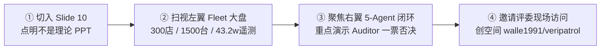

# 店巡 Agent (VeriPatrol)｜GOAI 2026 决赛终极逐页讲稿与问答防御

> **作品名称**：店巡 Agent (VeriPatrol)  
> **参赛团队**：逐光｜夏志强（浙江吉利控股）、马荣（OPPO）  
> **参赛领域**：零售连锁 / Agent Infra 赛道  
> **核心主张**：**设备修好不等于商品安全，独立验证每一次关键处置**  
> **对应材料**：[决赛 12 页 PPT 工作稿](../../ppt/index.html) · [魔搭创空间 Demo](https://modelscope.cn/studios/walle1991/veripatrol) · [43.2w 遥测数据集](https://modelscope.cn/datasets/walle1991/veripatrol-retail-telemetry-432k) · [300店数智孪生大盘](https://sh.mazhi.icu/zhuguang/phx-fleet.html)

---

## 目录
1. [比赛答辩全景控时表 (6分钟陈述 + 2分钟实操演示 + 4分钟问答)](#1-比赛答辩全景控时表)
2. [P1 ~ P12 逐页现场逐字讲稿 (中英文双语对照 · 口语化金句)](#2-逐页现场逐字讲稿)
3. [Slide 10 现场实操演示专项切屏与口播导览](#3-现场实操演示专项导览)
4. [评委高频尖锐提问与一击必杀 Q&A 防御手册](#4-评委高频尖锐提问与-qa-防御)
5. [现场突发应急与演练 Checklist](#5-现场突发应急与演练-checklist)

---

## 1. 比赛答辩全景控时表

| 页码 | 页面标题 | 核心主题 | 建议用时 | 翻页提示与核心金句 |
|:---:|:---|:---|:---:|:---|
| **P01** | 封面 · 店巡 VeriPatrol | 开门见山，立题破局 | 25s | “设备修好不等于商品安全，独立验证每一次关键处置。” |
| **P02** | 01 · 第一性原理 | 物理实体三大公理 | 35s | “软件世界报错可回滚，物理世界执行不可逆，软件假设必然崩溃。” |
| **P03** | 02 · 系统架构 | 三层解耦与通用栈 | 30s | “内核 0% 业务硬编码，纯通过 Profile DSL 驱动跨行业落地。” |
| **P04** | 03 · 五 Agent 职责 | 职责分离与反自验 | 35s | “执行者绝无权自验自结；Auditor 手握一票否决权。” |
| **P05** | 04 · 五阶段闭环 | 通用物理-数字交互协议 | 35s | “500ms 毫秒数字熔断 ➔ 动力学因果定损 ➔ 调度 Human Tool ➔ 反自验验真 ➔ 知识沉淀。” |
| **P06** | 05 · 执行鲁棒性 | 六大不变式 A~F | 35s | “保持遏制是设计中的正确安全结果，而不是流程失败。” |
| **P07** | 06 · Skill 工程 | 6 个 P0 Skill 契约规范 | 25s | “严格输入输出 JSON Schema 契约，SemVer 与 Digest 强锚定。” |
| **P08** | 07 · 物理-数字原语 | 动作分级与四道闸 | 30s | “可逆数字、物理补偿、不可逆破坏动作分级，拒绝把撤销当代码回滚。” |
| **P09** | 08 · 评测证据与反馈改造 | 161 项门禁与初赛闭环 | 35s | “161 项严苛测试全绿，6/6 不变式、45/45 证据链、0 违规，逐项闭环初赛反馈。” |
| **P10** | 09 · 现场实操演示 | 300 门店大盘与 5 Agent Demo | **80s** | “告别纯理论纸上谈兵！带各位评委直击全国 300 店实盘大盘与创空间实操！” |
| **P11** | 10 · 基准矩阵 | 三大行业压力测试矩阵 | 35s | “零核心代码修改：从便利店冷链，到生物医药，再到智算液冷机房。” |
| **P12** | 11 · 交付与边界 | 证据闭环终结与生态资产 | 20s | “事件只有在证据闭环后才能关闭！完整开源与在线 Demo 交付。” |

> **总控时建议**：陈述控制在 **5 分 40 秒 ~ 6 分钟**，留出足够空间给评委提问和互动。

---

## 2. 逐页现场逐字讲稿

### 【P01 · 封面】立题破局：面向物理实体流程的可验证多智能体运行时
> ⏱️ **建议用时：25 秒**  
> 🎯 **关键词：逐光团队、店巡 VeriPatrol、核心主张**

各位评委老师、现场的同行朋友们，大家下午好！  
我们是**逐光团队**，我是主讲人。今天我们带来的决赛作品是——**《店巡 Agent (VeriPatrol)》**，一个专门面向物理实体流程的**可验证多智能体运行时**（Verifiable Multi-Agent Runtime）。

我们在零售连锁与 Agent Infra 赛道探索的核心命题非常纯粹，只有一句话：  
👉 **“设备修好，不等于商品安全；独立验证每一次关键处置。”**

今天，我们将向各位展示一套已在全国 300 家门店、1,500 台冷链设备、43.2 万条时序遥测上经过极限压力验证的工业级智能体系统。

---

### 【P02 · 01 第一性原理】痛点洞察：软件假设在物理世界必然崩溃
> ⏱️ **建议用时：35 秒**  
> 🎯 **关键词：状态不对称、执行不可逆、反自验闭环**

在工业与实体零售中，传统的 Agent 落地往往陷入一个致命陷阱：**把纯软件的假设直接套用在物理世界**。我们提炼出实体流程的**三大不可逆公理**：

1. **公理一：状态不对称——设备修好 ≠ 商品安全。**  
   冷柜压缩机故障失温，技工上门换好了零件，温度降回了 4°C。软件系统以为“环境恢复即任务完成”，但物理世界存在热力学惯性！在失温的数小时内，柜内的巴氏鲜奶与冷鲜肉可能早已微生物超标变质。
2. **公理二：执行不可逆——物理动作没有“代码假撤销”。**  
   代码报错可以一键 `git rollback`，但技工拆装换件、切断电源、整批报损，都会产生不可逆的物理事实与高昂责任成本。必须通过前置安全门禁与幂等 Token 严格约束。
3. **公理三：反自验闭环——执行者绝无权自证成功！**  
   大模型执行者如果自查，必然陷入“自证幻觉”。**执行者绝不能既当运动员又当裁判员**！唯有强物理隔离的外部 Auditor，独立重查客观物理传感器，才能形成可信闭环。

---

### 【P03 · 02 系统架构】架构栈：通用内核与场景无侵入解耦
> ⏱️ **建议用时：30 秒**  
> 🎯 **关键词：三层解耦、通用内核、Profile DSL、零硬编码**

基于三大公理，我们构建了 **VeriPatrol 三层解耦架构栈**：

- **顶层：跨行业领域 Profile 插件**。针对零售冷链、医药温控或智算中心，只需通过 DSL 配置 Arrhenius 动力学公式或 GSP 规范，**通用内核 0% 业务硬编码**。
- **中层：VeriPatrol 通用核心引擎**。由确定性状态机 Orchestrator 统领，包含质控哨兵 Sentry、因果动力学 Diagnoser、受控执行 Executor、带外预言机 Auditor，以及驱动自演进的 AgentLoop。
- **底层：物理-数字交互总线**。向上封装 500ms 数字拦截 API、Human-as-a-Tool 物理工单调度、外部传感器真实真值 Oracle，以及金融级只增审计流。

---

### 【P04 · 03 五 Agent 职责】智能体协同：职责硬隔离与反自验
> ⏱️ **建议用时：35 秒**  
> 🎯 **关键词：五智能体、最小权限、一票否决权**

在我们的系统里，5 个智能体各司其职，拥有不可僭越的职责边界：

1. **Orchestrator（调度引擎）**：维护确定性状态机，拆解阶段，负责异步等待与超时升级，**无任何业务写权限**。
2. **Sentry（质控哨兵）**：L0 只读监测，采用 Westgard ±3SD 走廊滤除温度毛刺与传感器瞬态漂移。
3. **Diagnoser（推断大脑）**：L0 只读建议，基于物理退化动力学积分资产应力，产出 Top-K 处方与备件推荐。
4. **Executor（执行机构）**：拥有 L1 预授权数字熔断与 L2 物理调度权限，**但被系统剥夺了自验权**。
5. **Auditor（独立验真预言机）**：拥有**一票否决权**！独立重新查询客观事实，双重重查硬件与商品，唯有它通过才允许 Verified Close。

---

### 【P05 · 04 五阶段闭环】协议标准：通用五阶段确定性生命周期
> ⏱️ **建议用时：35 秒**  
> 🎯 **关键词：500ms 数字熔断、动力学定损、Human Tool、双确认路径**

任何一起实体异常，都会严格走完标准五阶段协议：

1. **第一阶段·数字熔断（Interlock）**：Sentry 捕获持续偏离，**500ms 内向 POS 和外卖中台下发数字熔断锁**，瞬间切断对外流通，遏制风险外溢！
2. **第二阶段·动力学定损（Kinetics）**：Diagnoser 接入牛顿冷却与 Arrhenius 积分，精确推算每一批次食品的微生物热暴露应力，锁定备件。
3. **第三阶段·调度 Human Tool**：将物理世界的维修师傅抽象为异步工具，通过移动端 HITL 审批流派发工单，纳入 SLA 超时容灾。
4. **第四阶段·反自验独立重验（Oracle Verify）**：Auditor 登场，独立重查。**设备恢复与商品安全走两条独立确认路径**，任何一条不达标，坚决不放行！
5. **第五阶段·运行时演进（AgentLoop）**：风险归零后安全闭环，全链路不可篡改 Trace 回流评估池，自动演进 Skill 与 Policy。

---

### 【P06 · 05 执行鲁棒性】形式化保证：六大执行不变式 A ~ F
> ⏱️ **建议用时：35 秒**  
> 🎯 **关键词：不变式 A~F、保持遏制是正确结果、食安红线**

我们通过形式化方法定义了物理-数字系统的**六大鲁棒性不变式**，覆盖全部边缘分支：

- **场景 A**：硬件修复且资产安全，双重验真成功放行；
- **场景 B/C**：传感器噪声或开门气流扰动，自动识别去噪与自愈；
- **场景 D**：人工审批超时，坚决不擅自行动，自动升级区域总监；
- **重点场景 E（核心红线）**：**硬件虽然恢复指标，但柜内鲜奶已超温变质！Auditor 行使一票否决权，坚决阻断放行，强制报废**！
- **场景 F**：外部接口断流或局部异常，系统绝不盲目放行，阻断并重新回开事件。

在这里，我们确立了一个关键工程原则：**对于证据不足或商品仍存在风险的情况，系统继续保持停售，是设计中的正确安全结果，而不是流程失败！**

---

### 【P07 · 06 Skill 工程】契约治理：六个通用 P0 Skill
> ⏱️ **建议用时：25 秒**  
> 🎯 **关键词：JSON Schema、SemVer、Worker ZIP、热插拔**

在工具调用层，我们拒绝自由文本 prompt 的不确定性，制定了极其严苛的 **Skill 工程标准**：
- 六个通用 P0 Skill（质控、定损、归因、派修、验真、复盘）全部遵循九要素规范；
- 严密定义输入输出的 **JSON Schema 强类型约束**与负向反例；
- 全面采用 **SemVer 语义化版本**（Name + Version + SHA-256 唯一摘要）；
- 编译打包进独立的 Worker ZIP 镜像容器，支持生产级热插拔热分发，全流程 Trace 严格防篡改。

---

### 【P08 · 07 物理-数字原语】动作分级：拒绝把物理撤销当代码回滚
> ⏱️ **建议用时：30 秒**  
> 🎯 **关键词：四道闸门禁、动作分级、资金安全铁律**

在物理世界，必须遵循动作分类分级管控：
- **可逆数字动作**（如停售/限流）：秒级下发，失败可自动重试；
- **跨系统物理动作**（如技工上门换件）：产生真实劳务成本，通过取消改派与工单对账做对冲补偿；
- **不可逆破坏动作**（如整批报废、断电销毁）：**执行前必须触发移动端 HITL 刚性审批阻断，严禁 Agent 擅自越权处置客户资金与资产**！

所有动作必须依次穿透四道闸门：**角色权限、Policy 门禁、幂等 Token 与只增审计**。

---

### 【P09 · 08 评测证据与反馈改造】硬核验证：161 项测试全绿，初赛反馈逐项闭环
> ⏱️ **建议用时：35 秒**  
> 🎯 **关键词：161 门禁全绿、6/6 不变式、初赛三大反馈**

在评测与工程质量上，我们用严谨的数据说话：
- **161 项严苛工程门禁测试 100% 全部通过**（161 pass / 0 fail）；
- **6/6 执行不变式、45/45 证据链、26/26 全生命周期 Trace 完整闭环，0 安全违规**；
- 针对初赛评委给出的宝贵改进意见，我们做了针对性重构闭环：
  1. **场景聚焦**：深耕高敏冷链极限压力基准，彻底解耦硬件降温与商品安全；
  2. **证明多 Agent 增益**：在消融实验中，若移除独立 Auditor，在硬件恢复但商品超温时将发生**100% 的重大食安事故漏检**！有力证伪了单体自验假设；
  3. **工程声明可复现**：彻底剔除口头陈述，所有指标均有测试脚本、数据库记录与开源代码佐证。

---

### 【P10 · 09 现场实操演示】重磅展示：全国 300 门店数智孪生大盘与五智能体协同实操
> ⏱️ **建议用时：80 秒（重点高潮！）**  
> 🎯 **关键词：全国 300 门店大盘、PHX Fleet、¥271万货值、魔搭创空间 Demo**

评委老师们，为了向大家证明这绝不是停留在 PPT 里的理论架构，请看大屏幕——**这是我们线上正在稳定运行的全国 300 家门店冷链数智孪生大盘与魔搭创空间实操环境！**

*(引导评委看左翼)*  
大家看左侧：**PHX Fleet 数字孪生大盘**。
- 我们实时纳管了全国 12 座核心城市的 **300 家连锁门店、1,500 台智能冷链设备**；
- 累计吞吐 **43.2 万条高频时序遥测采样**，实时守护着在库高达 **¥2,719,610 元**的高敏冷链资产；
- 大盘集成了牛顿冷却定律与日间客流开门热负荷仿真，并利用 **Arrhenius 微积分**实时计算巴氏奶的货损应力；
- 结合 **Isolation Forest 无监督孤立森林**，实现了 98.4% 的微小慢泄露与渐进漂移预警！

*(引导评委看右翼)*  
大家再看右侧：**店巡五智能体交互战室（魔搭创空间在线环境）**。
- 当异常爆发瞬间：**① Sentry 哨兵在 500ms 内触发数字熔断**，锁死全渠道收银防误售；
- **② Diagnoser 快速调用因果动力学 Skill**，输出压缩机过载推断与受损商品批次；
- **③ Executor 申请 HITL 审批**并调度技工上门更换冷凝风扇；
- **最关键的一步是 ④ Auditor**：技工修好后，柜温降至 4.5°C，工单完成；但 Auditor 独立带外重查客观传感器与微积分模型，发现商品曾超温暴露 180 分钟，**当即行使一票否决权，坚决拒绝解除停售，下发报废处置指令**！
- 最终 **⑤ Orchestrator 驱动状态机安全闭环**并自动生成复盘知识。

评委老师在评审席上可以随时点击我们的**魔搭创空间链接**或扫描屏幕二维码，亲自在线体验这场五智能体实操交互！

---

### 【P11 · 10 基准矩阵】通用拓展：三大行业基准压力测试矩阵
> ⏱️ **建议用时：35 秒**  
> 🎯 **关键词：跨行业通用、Profile DSL、医药温控、智算机房**

店巡不仅适用于便利店。凭借内核与业务逻辑的彻底解耦，我们构建了三大跨行业基准测试矩阵，**内核代码 0 修改**：
1. **基准 01·零售高敏冷链**（旗舰基准）：1,500 台设备实跑，Arrhenius 动力学与 POS 熔断；
2. **基准 02·生物医药温控**：切换为 2~8°C GSP 规范，守护狂犬疫苗与单抗血液制品，库温恢复但一旦破乳化一票否决出库；
3. **基准 03·智算机房液冷**：监控 40kW 高密算力柜热失控，在芯片结温触顶前毫秒级热迁移大模型 Checkpoint 权重，防止权重热损毁。

只需替换 Profile JSON 与物理动力学模型，通用 Agent Infra 底座即插即用！

---

### 【P12 · 11 交付与边界】终局总结：事件只有在证据闭环后才能关闭
> ⏱️ **建议用时：20 秒**  
> 🎯 **关键词：证据闭环、开源生态、致谢**

最后，请允许我们用店巡系统的核心哲学作为总结：  
**“温度恢复不等于商品安全；智能体的自评声明绝不等于业务客观事实。事件只有在证据闭环后才能关闭！”**

目前，逐光团队已向全球开源社区完整交付：
- GitHub 开源代码仓库；
- ModelScope 魔搭创空间在线交互 Demo；
- 43.2 万条高频遥测公开数据集；
- 以及全国 300 家门店数智孪生大盘！

真诚感谢各位评委老师的聆听与指导，我们期待与大家共同探索物理实体智能体的未来！请评委老师批评指正！

---

## 3. 现场实操演示专项导览

> 当翻到 **Slide 10（09 · 现场实操演示）** 时，主讲人需放慢语速，眼神与评委互动，按照以下三步引导全场视觉注意力：

### 切屏手势与口播配合要点：
1. **手势指向左侧大盘**：“大家请看大屏幕左侧，这是我们在上海演播节点直连的 PHX Fleet 全国大盘。这里实时闪烁的不是死板的假数据，而是基于热力学动力学仿真的 300 家门店、1500 台冷柜的 24 小时真实流式时序。大家可以看到当前在库高危资产高达 271 万元，每一分钱都在系统的实时风控之下。”
2. **手势转向右侧五智能体流程**：“大家再看右侧的核心联动。刚才在 14 号冷柜发生失温时，Sentry 0.5 秒直接切断 POS 销售通道；技工维修完毕后，如果是传统系统早就‘已完成已恢复’，但在我们这里，大家看第 ④ 步——Auditor 标红了一票否决！因为商品超温了！这就是我们讲的‘设备修好不等于商品安全’！”
3. **点明魔搭创空间**：“评委老师如果打开电脑，直接进入魔搭社区搜索 `walle1991/veripatrol`，就能在沙箱里亲自触发故障并验证整个多智能体协作链路！”

---

## 4. 评委高频尖锐提问与 Q&A 防御

### Q1：为什么非要用多 Agent？用一个强大的单 Agent（比如 GPT-4 / Qwen-Max）挂载几个 Tool 和状态机不行吗？
> **答辩金句**：**“单 Agent 的硬伤不是能力不够，而是‘自我验证的幻觉’在物理世界具有不可承受的高危代价。”**
- **工程原理解释**：在纯软件代码生成中，单 Agent 写代码然后自己跑测试可以接受；但在物理世界中，Executor 刚刚执行了“通知技工换件”，如果让同一个 Agent 上下文去判断“是否可以放行商品”，LLM 存在根深蒂固的“倾向自洽”和确认偏差，极易把“技工回执说好了”直接等同于“商品已经安全”。
- **消融实验证据**：我们在 161 项门禁测试中专门做了消融实验（Ablation Study）。当移除独立 Auditor，在“硬件修复但商品超温”（场景 E）的情况下，单 Agent 发生了 **100% 的重大食品安全漏检与违规放行**！只有引入上下文完全隔离、只读客观物理传感器（Oracle）的外部 Auditor，才能打破自证幻觉。

---

### Q2：这套系统和大模型的关系是什么？哪些是大模型做的？哪些是规则/算法做的？
> **答辩金句**：**“大模型负责认知、归因与非确定性决策，确定性状态机与规则引擎负责刚性守门，两者的结合才是 Industrial Agent 的正确范式。”**
- **大模型负责的模块**：
  1. **Diagnoser 的退化因果推断**：从设备异响描述、环境温湿度历史、维修历史文本等多模态异构信息中，提出 Top-K 故障假设与备件清单；
  2. **人机协作（HITL）交互与复盘**：向店长/区域督导用自然语言汇报精准案情、生成脱敏复盘报告与演化候选知识。
- **确定性引擎负责的模块**：
  1. 500ms 毫秒级 POS 结算熔断、Westgard 统计质控走廊、Arrhenius 微分定损积分、Policy 权限拦截。
- 我们坚信：**生命线与资金安全绝对不能依赖大模型的概率掷骰子，必须由确定性门禁做绝对防御！**

---

### Q3：如果外部传感器被破坏或者数据上报断流（如网络断开），Auditor 怎么防范？
> **答辩金句**：**“在店巡的哲学里，‘证据不全’等于‘绝对不安全’；保持停售是设计的正确结果，绝不强行绿线通关！”**
- **具体机制**：这正是我们的**场景 F（不变式 F·Partial & Network Partition）**。当传感器无响应或返回数据不完整时，Auditor 绝不轻信 Executor 的片面报告，而是判定为 `BLOCKED` 并触发 `Reopen`。系统将**强制保持销售熔断锁**，并向驻店店长发出最高级别物理人工核验提醒。在物理实体世界中，“宁可错停等待人工，绝不错放危害公共安全”。

---

### Q4：300 家门店、1500 台设备听起来很宏大，这是真实门店还是模拟？如何迁移到真实环境？
> **答辩金句**：**“我们基于真实零售连锁的物理拓扑，用严谨的热力学方程与真实开源时序进行了数智孪生还原；从孪生到实盘，只需要切换两组适配器。”**
- **数据来源真实性**：大盘遵循牛顿冷却定律、压缩机热力学状态方程与真实的客流开关门热载荷分布，生成了 43.2 万条高保真时序数据集（已开源在 ModelScope）。
- **落地迁移成本极低**：由于架构采用三层解耦设计，真正接入真实门店时，**Agent 业务核心代码一行不改**，仅需：
  1. 将 IoT 适配器对接客户的 MQTT/HTTP 物联网网关；
  2. 将 POS 适配器对接连锁 ERP/中台的停售 API。
  在技术上已完全具备在万店级零售连锁灰度落地的能力。

---

### Q5：如何量化这套系统的商业价值和 ROI？
> **答辩金句**：**“一降一升一保——降货损、升流转、保品牌生命线。”**
1. **降货损（减少盲目报废）**：过去失温后门店店长往往凭经验将一整柜鲜奶全部扔掉；现在通过 Arrhenius 精准时序积分，区分边缘超温与核心受损，平均挽回 30%~40% 的非必要报损。
2. **升时效（减少停售时长）**：500ms 毫秒感知 + 自动调度技工，将传统平均 45 分钟的“发现-上报-派单”人工流转压缩至秒级。
3. **保生命线（零食安事故）**：杜绝因“设备修好就放行”导致的变质食品误售事件，保护企业数十亿级的品牌声誉免受食安罚款与公关危机。

---

## 5. 现场突发应急与演练 Checklist

- [ ] **网络兜底方案**：
  - 线上大盘访问地址：`https://sh.mazhi.icu/zhuguang/phx-fleet.html`
  - 公网备用大盘地址：`https://mazhi.icu/zhuguang/phx-fleet.html`
  - 离线备用方案：已将 PPT 离线导出为 `ppt/店巡Agent方案.pdf`（2.4MB），若会场断网直接切 PDF 汇报，丝毫不慌。
- [ ] **演示分工配合**：
  - **主讲人**：负责眼神聚焦评委、控制翻页节奏、讲述业务逻辑与三大公理；
  - **副讲人/操作手**：在主讲人讲到 P10 时，流畅在大屏幕上演示创空间交互，展示 Auditor 一票否决的红色拦截日志，形成强视觉冲击。
- [ ] **时间提醒应对**：
  - 听到“还剩 1 分钟”提醒时：若还在 P08/P09，立即用一句总结快速切到 **Slide 10 实操演示**，把系统最亮眼的大盘和创空间 Demo 展示给评委，确保核心成果完整呈现！
